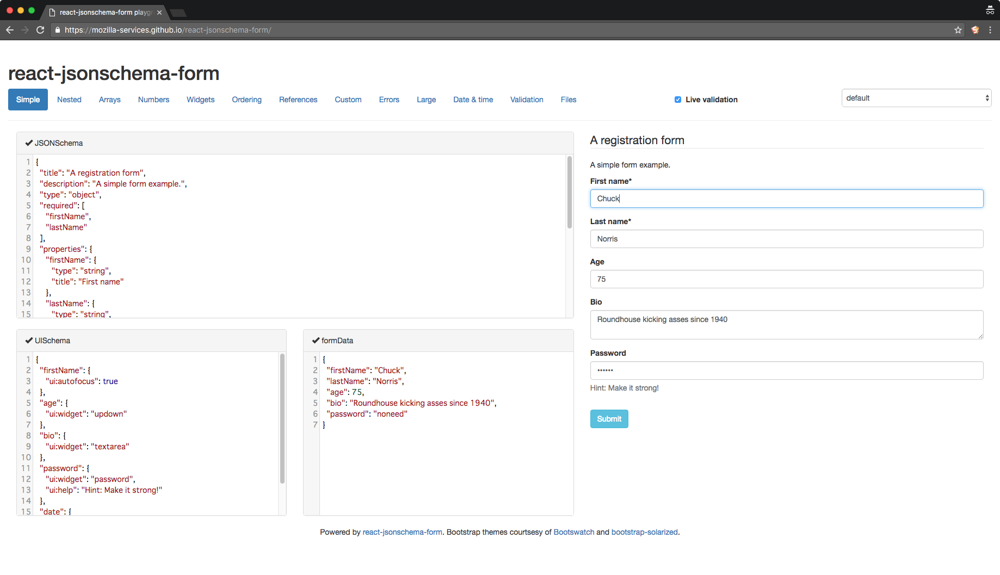

フォームのイベントハンドラをどう扱うか問題
------------------------------------------

### なんの話か

- React でフォーム項目を簡潔に書く方法がわからない
- 管理されたコンポーネントで書こうとすると、項目の数だけ state と対応するイベントハンドラが必要になる
    - 親に渡す必要がある、とかだとさらにしんどい

```javascript
class MyFormCmp extends React.Component {

  constructor(props) {
    super(props);

    this.state = {
      name: '',
    };

    this.onChangeName = this.onChangeName.bind(this);
  }

  onChangeName(e) {
    console.log(e.target.value);
    this.setState({ name: e.target.value });
  }

  render() {
    return (
      <form>
        <input type="text" value={this.state.name} onChange={this.onChangeName} />
      </form>
    );
  }
}
```

### どうすべきか

いくつか方法はある。  
1 と 2 は微妙に違うが、「イベントハンドラを1つにまとめる」という戦略自体は同じ。

#### 1. onChange イベントハンドラに引数で key を渡す

```javascript
export default class MyFormCmp extends React.Component {

  constructor(props) {
    this.state = {
      name: '',
    };

    this.onChangeField = this.onChangeField.bind(this);
  }

  onChangeField(e, keyName) {
    console.log(e.target.value, keyName);
    this.setState({ [keyName]: e.target.value });
  }

  render() {
    return (
      <form>
        <input type="text" value={this.state.name} onChange={(e) => this.onChangeField(e, 'name')} />
      </form>
    );
  }
}
```

#### 2. イベントハンドラ内で `event.target.name` を参照する

参考：[ES2015 以降で React 書くなら form 部品での onChange で setState するのもう全部これでいいんじゃないかなあ - BattleProgrammerShibata](http://bps-tomoya.hateblo.jp/entry/2016/05/25/154401)

```javascript
export default class MyFormCmp extends React.Component {
  // 略

  onChangeField(e) {
    console.log(e.target.name, e.target.value);
    this.setState({ [e.target.name]: e.target.value });
  }

  render() {
    return (
      <form>
        <input
          name="name"
          type="text"
          value={this.state.name}
          onChange={this.onChangeField}
        />
      </form>
    );
  }
}
```

##### 3. (deprecated)[LinkedStateMixin](https://www.npmjs.com/package/react-addons-linked-state-mixin) というアドオンを使う

参考：[Two-Way Binding Helpers | React](https://facebook.github.io/react/docs/two-way-binding-helpers.html) ([日本語](https://facebook.github.io/react/docs/two-way-binding-helpers-ja-JP.html))

> ReactLink is deprecated as of React v15. The recommendation is to explicitly set the value and change handler, instead of using ReactLink.

ただし、ES2015 で書いた React コンポーネントは、そのままでは Mixin を使うことができない。  
[react-mixin](https://github.com/brigand/react-mixin) というライブラリを使う。

参考：[React v0.13から使えるようになったES6のclass構文でmixinを使う - Qiita](http://qiita.com/enu-kuro/items/d21aeff1f3c11cda008f)

```javascript
import React from 'react';
import reactMixin from 'react-mixin';
import { render } from 'react-dom';
import LinkedStateMixin from 'react-addons-linked-state-mixin';

class MyFormCmp extends React.Component {

  constructor(props) {
    super(props);

    this.state = {
      name: '',
    };
  }

  render() {
    return (
      <form>
        <input
          type="text"
          valueLink={this.linkState('name')}
        />
      </form>
    );
  }
}
reactMixin(MyFormCmp.prototype, LinkedStateMixin);
```

#### 4. (未検証) [react-jsonschema-form](https://github.com/mozilla-services/react-jsonschema-form) を使う

元々は JSON Schema という、JSON オブジェクトの値の有無や型のチェックをするための仕様があって  
react-jsonschema-form は JSON Schema からフォームを生成できるライブラリっぽい。

以下、JSON Schema の例。`properties` がフォームの項目に相当。

```javascript
{
  "title": "A registration form",
  "description": "A simple form example.",
  "type": "object",
  "required": [
    "firstName",
    "lastName"
  ],
  "properties": {
    "firstName": {
      "type": "string",
      "title": "First name"
    },
    "lastName": {
      "type": "string",
      "title": "Last name"
    },
    "age": {
      "type": "integer",
      "title": "Age"
    },
    "bio": {
      "type": "string",
      "title": "Bio"
    },
    "password": {
      "type": "string",
      "title": "Password",
      "minLength": 3
    }
  }
}
```

実際にはこれとは別に `UISchema` なるものの定義が必要らしいが、ここから生成されるフォームはこんな感じ。  
([react-jsonschema-form playground](https://mozilla-services.github.io/react-jsonschema-form/) で確認できる)




いかんせんまだ触ったことがないので、スタイルやバリデーションルール含めどれぐらいきめ細かく設定ができるのか不明。

### おわりに

3 は現在推奨されてないので除外。4 が一番気になってる。1 と 2 については正直差はないと思う。  
また、1 ~ 3 の方法は「入門 React」にも書いてた。(p.81 ~ p.84 あたり)
